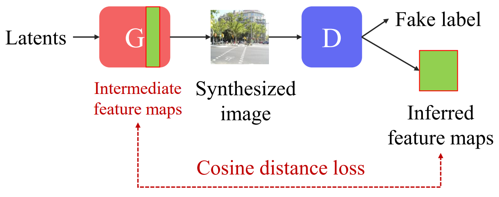

# GGDR - Generator-Guided Regularization for Discriminator (Official PyTorch Implementation)
**Generator Knows What Discriminator Should Learn in Unconditional GANs (ECCV 2022)** \
Gayoung Lee, Hyunsu Kim, Junho Kim, Seonghyeon Kim, Jung-Woo Ha, Yunjey Choi

<div align="center">
  
</div>

> **Abstract** *Recent conditional image generation methods benefit from dense supervision such as segmentation label maps to achieve high-fidelity. However, it is rarely explored to employ dense supervision for unconditional image generation. Here we explore the efficacy of dense supervision in unconditional generation and find generator feature maps can be an alternative of cost-expensive semantic label maps. From our empirical evidences, we propose a new **generator-guided discriminator regularization (GGDR)** in which the generator feature maps supervise the discriminator to have rich semantic representations in unconditional generation. In specific, we employ an encoder-decoder architecture for discriminator, which is trained to reconstruct the generator feature maps given fake images as inputs. Extensive experiments on mulitple datasets show that our GGDR consistently improves the performance of baseline methods in terms of quantitative and qualitative aspects. Code will be publicly available for the research community.*

## Credit
We attach GGDR to [StyleGAN2-ADA-pytorch](https://github.com/NVlabs/stylegan2-ada-pytorch), so heavily brought their codes.

## Usage
Usage of this repository is almost same with [StyleGAN2-ADA-pytorch](https://github.com/NVlabs/stylegan2-ada-pytorch) except GGDR option. See their repository for more detailed instructions.

#### Training StyleGAN2-ADA with GGDR
```
> python train.py --outdir=training-runs  --reg_type=ggdr --ggdr_res=64 --gpus=8 --cfg=paper256 --data=./datasets/ffhq256.zip
```
Belows are some additional arguments can be customized. 
- ```--reg_type=ggdr``` Enable GGDR (default: disabled)
- ```--ggdr_res=64``` Set target feature map by given resolution for GGDR (default: 64). If you use smaller images(e.g. cifar10), it is recommended to set this $(resolution) / 4 (e.g. 8 for cifar10).
- ```--aug=noaug``` Disables ADA (default: enabled)
- ```--mirror=1``` Enables x-flips (default: disabled)

#### Inference with trained model
```
> python generate.py --outdir=out --seeds=100-200 --network=PATH_TO_MODEL
```

## License
Licensed under NVIDIA Source Code License for StyleGAN2 with Adaptive Discriminator Augmentation (ADA).

## Citation
```bibtex
@inproceedings{lee2022ggdr,
  title={Generator Knows What Discriminator Should Learn in Unconditional GANs},
  author={Lee, Gayoung and Kim, Hyunsu and Kim, Junho and Kim, Seonghyeon and Ha, Jung-Woo and Choi, Yunjey},
  booktitle={ECCV},
  year={2022}
}
```
